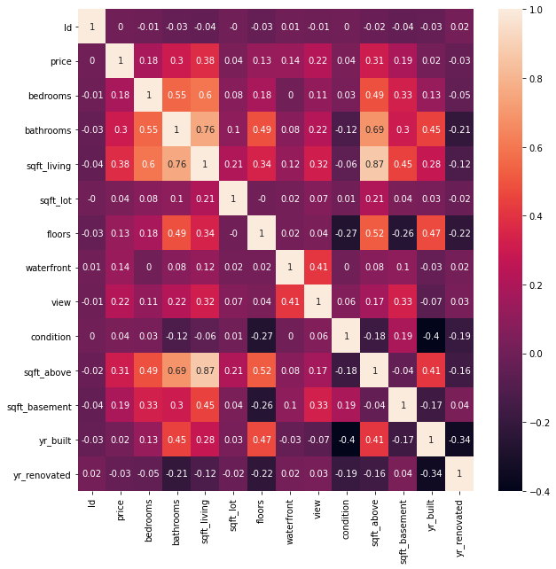
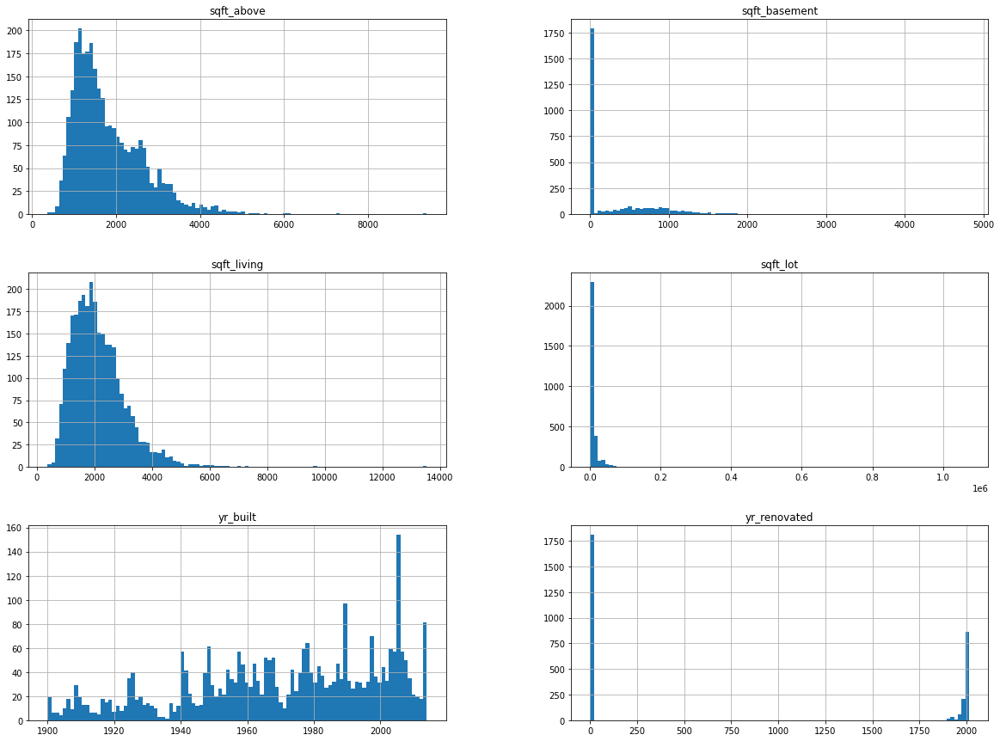
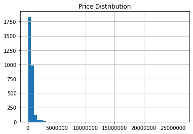
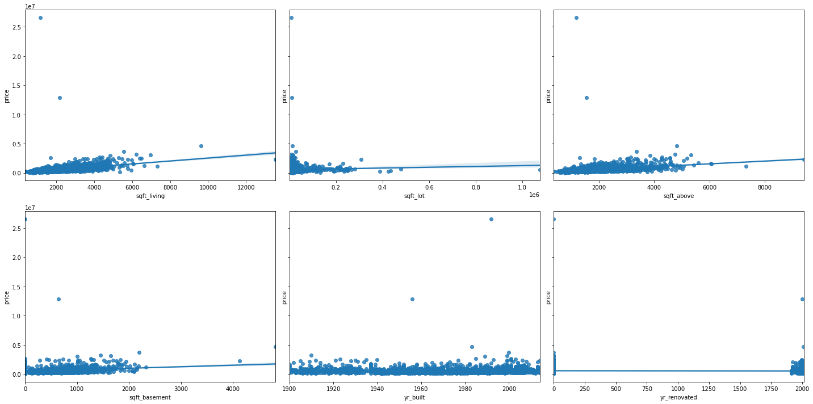

# House Price Prediction with KNN Regressor

>This is a competition for UT Dallas MIS/BUAN students. The purpose of this competition is to evaluate pre-processing steps and use pipelines. Students will learn how to use various preprocessing steps and KNN regression in a single pipeline. The competition is based on a subset of data from Kaggle Competition: https://www.kaggle.com/shree1992/housedata

>The detailed description of the data can be found at https://www.kaggle.com/shree1992/housedata
## Correlation matrix



## Variable Types

### Categorical Features
 
	 view
	 condition
	 waterfront
	 city
	 statezip
### Discreate Features

	 bedrooms
	 bathrooms
	 floors
### Continous Features 

	 sqft_living
	 sqft_lot
	 sqft_above
	 sqft_basement
	 yr_built
	 yr_renovated 

## Distribution of each continuous feature

### Key take aways from disctribution graphs:
* More than half of the data doesn't have the year of rennovation values, that can be either due to no rennovations recorded for that house or no rennovations done
* There are outliers in variables like "sqft_lot" with abnormal data values



### Distribution of Price



## Removing Outliers
 
There are some outlier that could potentially affect the regression, removing the outliers could help make better predictions

* Capping the price of the house variable to 1 million(1000000)
* Capping Bathrooms to 5
* Capping number of bedrooms to 4
* Capping sqft_living to 5000
* Capping sqft_above to 5000

## Dependency of the price on each continuous feature

Visualizing dependancy of price on Continous Features
Looking at the scatter plots, we can see that there are few outliers in the data with abnormal data values which was also seen in the univariate distribution graphs

Looking at the yr_rennovated data from both histogram and scatter plot, >50% of the data has 0s. This may be due to various reasons discussed above, hence we can consider to drop this column



## Number of unique values for each variable
    Id : 3000
    price : 1326
    bedrooms : 10
    bathrooms : 23
    sqft_living : 481
    sqft_lot : 2183
    floors : 6
    waterfront : 2
    view : 5
    condition : 5
    sqft_above : 439
    sqft_basement : 187
    yr_built : 115
    yr_renovated : 58
    street : 2970
    city : 41
    statezip : 75
    country : 1

## Best Parameters for KNN Regressor 
```
cv=10, N=np.arange(1, 15, 2)

test_size=0.2, random_seed = 42, Validation score: 0.78, Test score: 0.65

Best Parameters

{'categorical_encoder__top_categories': None,
'encoder_rare_label__tol': 0.01,
'knn__n_neighbors': 5,
'scaler': StandardScaler(copy=True, with_mean=True, with_std=True)}
```